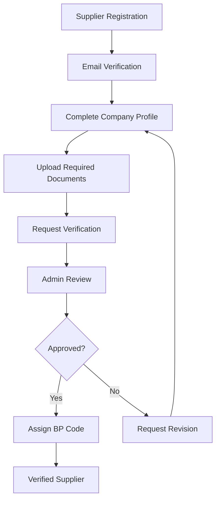
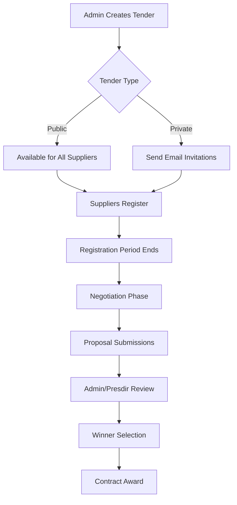
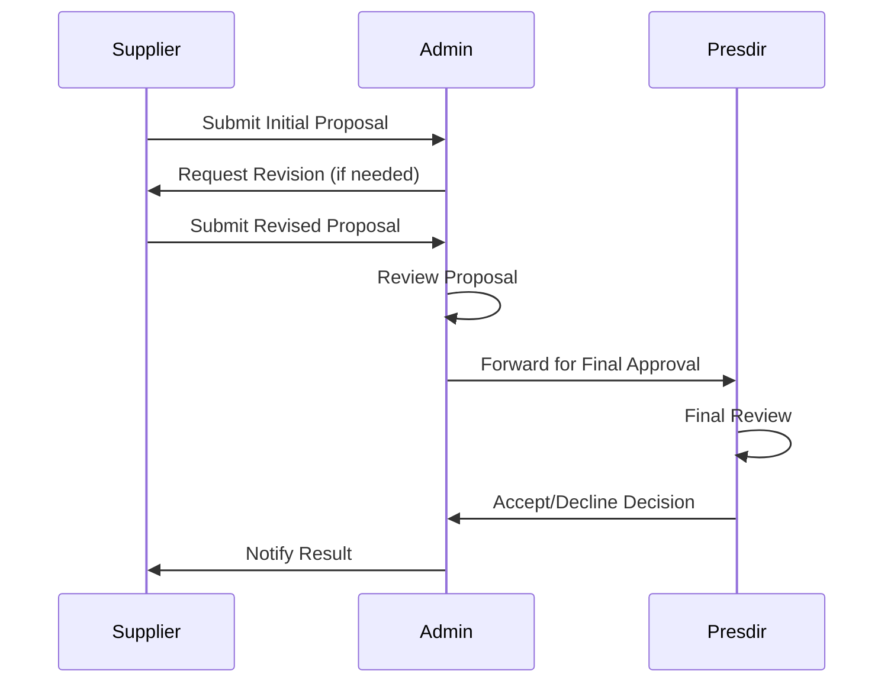

# E-Procurement System PT. Sanoh Indonesia

<div align="center">
  
  <h3>Sistem E-Procurement untuk Manajemen Tender dan Pengadaan</h3>
  <p><em>Transformasi Digital dalam Proses Pengadaan Perusahaan</em></p>
  
  
  
  
  
  
</div>

---

## 📋 Daftar Isi

- [Tentang Aplikasi](#-tentang-aplikasi)
- [Fitur Utama](#-fitur-utama)
- [Role dan Akses](#-role-dan-akses)
- [Persyaratan Sistem](#-persyaratan-sistem)
- [Instalasi](#-instalasi)
- [Cara Penggunaan](#-cara-penggunaan)
- [Struktur Proyek](#-struktur-proyek)
- [Teknologi yang Digunakan](#-teknologi-yang-digunakan)
- [API dan Backend](#-api-dan-backend)
- [Business Logic](#-business-logic)
- [Print System](#-print-system)
- [Deployment](#-deployment)
- [FAQ dan Troubleshooting](#-faq-dan-troubleshooting)
- [Kontribusi](#-kontribusi)
- [Lisensi](#-lisensi)

---

## 🏢 Tentang Aplikasi

E-Procurement System PT. Sanoh Indonesia adalah aplikasi web modern yang dirancang untuk mengelola seluruh proses pengadaan (procurement) perusahaan secara digital. Sistem ini memfasilitasi interaksi antara perusahaan dengan supplier dalam proses tender, negosiasi, dan manajemen dokumen.

### Visi & Misi
- **Visi**: Menjadi platform digital terdepan dalam manajemen procurement yang efisien dan transparan
- **Misi**: Mengotomatisasi proses tender, meningkatkan transparansi, dan mempercepat pengambilan keputusan procurement

---

## ✨ Fitur Utama

### 🔐 Sistem Autentikasi & Autorisasi
- **Multi-role Authentication**: Login berbasis role dengan keamanan tinggi
- **Session Management**: Manajemen sesi pengguna dengan auto-logout
- **Password Reset**: Sistem reset password melalui OTP email
- **Account Verification**: Verifikasi akun supplier melalui admin

### 👥 Manajemen User
- **User Management**: CRUD user dengan role-based access
- **Profile Management**: Update profil dan informasi perusahaan
- **Online User Tracking**: Monitor user yang sedang online
- **User Activity Logs**: Pelacakan aktivitas user

### 📊 Dashboard Analytics
- **Super Admin Dashboard**: Statistik user, login performance, dan monitoring
- **Admin Dashboard**: Overview tender, supplier, dan status proyek
- **Supplier Dashboard**: Status tender, notifikasi, dan dokumen

### 🏗️ Manajemen Tender/Project
- **Project Creation**: Pembuatan tender/project baru
- **Project Management**: Edit, close, delete project
- **Invitation System**: Undang supplier spesifik (Private tender)
- **Public Tender**: Tender terbuka untuk semua supplier
- **Registration Management**: Kelola pendaftaran supplier ke tender

### 💼 Manajemen Supplier
- **Company Profile**: Profil lengkap perusahaan supplier
- **Document Management**: Upload dan verifikasi dokumen
- **Verification System**: Proses verifikasi supplier oleh admin
- **BP Code Assignment**: Penugasan kode supplier

### 🤝 Sistem Negosiasi
- **Proposal Submission**: Submit proposal dengan lampiran
- **Negotiation History**: Riwayat negosiasi lengkap
- **Revision Management**: Kelola revisi proposal
- **Final Proposal**: Submit proposal final
- **Winner Selection**: Pemilihan pemenang tender

### 📄 Manajemen Dokumen
- **File Upload/Download**: Upload dan download dokumen
- **File Preview**: Preview dokumen dalam aplikasi
- **Document Validation**: Validasi format dan ukuran file
- **Secure File Storage**: Penyimpanan file yang aman

### 🔔 Sistem Notifikasi
- **Real-time Notifications**: Notifikasi real-time
- **Email Notifications**: Notifikasi via email
- **Toast Messages**: Pesan popup untuk feedback
- **Announcement System**: Sistem pengumuman

---

## 👤 Role dan Akses

### 1. Super Admin (Role ID: 1)
**Akses Penuh Sistem**
- ✅ Dashboard analytics lengkap
- ✅ Manajemen semua user
- ✅ Monitor user online
- ✅ User login performance
- ✅ Logout user secara paksa
- ✅ System configuration

**Menu Akses:**
- Dashboard
- Manage User
- Add User

### 2. Admin Purchasing (Role ID: 2)
**Manajemen Tender & Supplier**
- ✅ Create, edit, delete tender
- ✅ Manage tender registration
- ✅ Negosiasi dengan supplier
- ✅ Kelola data supplier
- ✅ Verifikasi supplier
- ✅ Generate reports

**Menu Akses:**
- Dashboard
- Manage Offers
- Registered Offers
- Company Data
- Verification

### 3. Presdir (Role ID: 3)
**Approve & Final Decision**
- ✅ View semua tender
- ✅ Final approval proposal
- ✅ Accept/Decline proposal
- ✅ Penetapan pemenang
- ✅ Executive dashboard

**Menu Akses:**
- Dashboard
- Registered Offers (View only)
- Negotiation (Final approval)

### 4. Review (Role ID: 4)
**Review & Monitoring**
- ✅ Review tender dan proposal
- ✅ Monitoring progress
- ✅ View reports
- ✅ Company data review

**Menu Akses:**
- Dashboard
- Registered Offers (View only)
- Company Data (View only)

### 5. Supplier (Role ID: 5)
**Participation & Submission**
- ✅ Lihat tender available
- ✅ Daftar ke tender
- ✅ Submit proposal
- ✅ Negosiasi dengan admin
- ✅ Update company profile
- ✅ Upload dokumen

**Menu Akses:**
- Dashboard
- Available Offers
- Registered Offers
- Company Data
- Verification

---

## 💻 Persyaratan Sistem

### Development Environment
```bash
Node.js     >= 18.0.0 (Recommended: 18.17.0+)
NPM         >= 9.0.0
Git         >= 2.40.0
```

### Browser Support
- Chrome >= 90
- Firefox >= 88
- Safari >= 14
- Edge >= 90

### Hardware Requirements
**Minimum:**
- RAM: 4GB
- Storage: 2GB free space
- Processor: Dual-core 2GHz

**Recommended:**
- RAM: 8GB+
- Storage: 5GB+ free space
- Processor: Quad-core 3GHz+

---

## 🚀 Instalasi

### 1. Clone Repository
```bash
git clone https://github.com/sanoh-intern/fe-eproc-sanoh.git
cd fe-eproc-sanoh
```

### 2. Install Dependencies
```bash
# Menggunakan NPM
npm install

# Atau menggunakan Yarn
yarn install
```


### 3. Start Development Server
```bash
npm run dev
```

### 4. Build untuk Production
```bash
npm run build
```

### 5. Preview Production Build
```bash
npm run preview
```

---

## 📚 Cara Penggunaan

### Untuk Super Admin

#### 1. Login ke Sistem
```
URL: http://localhost:5173
Email: superadmin@sanohindonesia.co.id
```

#### 2. Manajemen User
- Buka menu **Manage User**
- Klik **Add User** untuk tambah user baru
- Isi form dengan role yang sesuai
- User akan menerima email konfirmasi

#### 3. Monitor System
- **Dashboard**: Lihat statistik user online, total user
- **Login Performance**: Analisis performa login
- **User Online**: Monitor dan logout user aktif

### Untuk Admin Purchasing

#### 1. Membuat Tender Baru
```bash
Menu: Manage Offers → Create New Project
```
- Isi detail project
- Set tanggal registration due
- Upload attachment (PDF)
- Pilih type: Public/Private
- Jika Private, masukkan email supplier

#### 2. Kelola Supplier
```bash
Menu: Company Data
```
- Lihat daftar supplier terdaftar
- Review dokumen supplier
- Proses verifikasi

#### 3. Proses Negosiasi
```bash
Menu: Registered Offers → Details
```
- Lihat proposal supplier
- Download attachment
- Proses accept/decline (untuk Presdir)

### Untuk Supplier

#### 1. Registrasi & Verifikasi
- Daftar melalui halaman register
- Lengkapi company profile
- Upload dokumen yang diperlukan
- Tunggu verifikasi admin

#### 2. Ikut Tender
```bash
Menu: Available Offers
```
- Browse tender yang tersedia
- Klik **Register** untuk ikut
- Setujui MoU agreement

#### 3. Submit Proposal
```bash
Menu: Registered Offers → Detail → Negotiation
```
- Input total amount
- Upload proposal file
- Submit proposal

---

## 📁 Struktur Proyek

```
fe-eproc-sanoh/
├── public/                     # Static assets
│   ├── data.json              # Data konfigurasi
│   ├── icon_sanoh.png         # Logo perusahaan
│   └── assets/                # Asset tambahan
├── src/
│   ├── api/                   # API calls & data fetching
│   │   ├── route-api.tsx      # API endpoints
│   │   ├── useFetch.tsx       # Custom hooks
│   │   ├── Action/            # API actions
│   │   └── Data/              # Data fetchers
│   ├── assets/                # Styling & media
│   │   ├── css/               # CSS files
│   │   ├── fonts/             # Font files
│   │   └── images/            # Images
│   ├── authentication/        # Auth system
│   │   ├── AuthContext.tsx    # Auth context
│   │   ├── ProtectedRoute.tsx # Route protection
│   │   └── Role.tsx           # Role definitions
│   ├── common/                # Common components
│   │   └── Loader/            # Loading components
│   ├── components/            # Reusable components
│   │   ├── Calendar.tsx       # Calendar component
│   │   ├── Charts/            # Chart components
│   │   ├── Forms/             # Form components
│   │   ├── Table/             # Table components
│   │   └── ...
│   ├── hooks/                 # Custom hooks
│   │   ├── fireToast.tsx      # Toast notifications
│   │   ├── useColorMode.tsx   # Theme management
│   │   └── useLocalStorage.tsx
│   ├── layout/                # Layout components
│   │   ├── DefaultLayout/     # Main layout
│   │   └── DashboardLayout/   # Dashboard layout
│   ├── pages/                 # Page components
│   │   ├── Authentication/    # Auth pages
│   │   ├── Dashboard/         # Dashboard pages
│   │   ├── Offers/            # Tender/offers pages
│   │   ├── CompanyData/       # Company pages
│   │   ├── ManageUser/        # User management
│   │   └── Verification/      # Verification pages
│   ├── types/                 # TypeScript types
│   ├── App.tsx                # Main app component
│   └── main.tsx               # App entry point
├── package.json               # Dependencies
├── vite.config.js             # Vite configuration
├── tailwind.config.cjs        # Tailwind configuration
├── tsconfig.json              # TypeScript configuration
└── README.md                  # Documentation
```

---

## 🛠️ Teknologi yang Digunakan

### Frontend Framework
- **React 18.3.1**: Library JavaScript untuk UI
- **TypeScript**: Type-safe JavaScript
- **Vite 4.4.7**: Build tool dan dev server

### Styling & UI
- **Tailwind CSS 3.4.1**: Utility-first CSS framework
- **PostCSS**: CSS processing
- **CoreUI React**: UI component library
- **Headless UI**: Unstyled UI components
- **React Icons**: Icon library

### State Management & Forms
- **React Context**: Global state management
- **React Router DOM**: Client-side routing
- **React Hook Form**: Form handling
- **React Tabs**: Tab component

### Data Visualization
- **ApexCharts**: Interactive charts
- **React ApexCharts**: React wrapper untuk ApexCharts

### File & Document Handling
- **React PDF Renderer**: PDF generation
- **jsPDF**: PDF creation
- **jsPDF AutoTable**: PDF tables
- **html2pdf.js**: HTML to PDF conversion
- **file-saver**: File download utility
- **XLSX**: Excel file handling

### Date & Time
- **Date-fns**: Date utility library
- **Moment.js**: Date manipulation
- **React DatePicker**: Date picker component
- **React Big Calendar**: Calendar component

### Notifications & Alerts
- **React Toastify**: Toast notifications
- **SweetAlert2**: Beautiful alerts
- **React Hot Toast**: Toast notifications

### HTTP & API
- **Axios**: HTTP client
- **Fetch API**: Native HTTP requests

### Development Tools
- **ESLint**: Code linting
- **Prettier**: Code formatting
- **Babel**: JavaScript compiler

---

## 🔌 API dan Backend

### Base URL
```
Production: https://api.e-proc.profileporto.site/api/v1
Development: http://127.0.0.1:8000/api/v1
```

### Authentication Endpoints
```typescript
POST /login                    // User login
POST /logout                   // User logout
POST /guest/register           // User registration
POST /guest/reset-password     // Reset password step 1
POST /guest/verification-token // Reset password step 2
```

### Admin Endpoints
```typescript
// User Management
GET    /admin/user/list           // List all users
POST   /admin/user/create         // Create new user
GET    /admin/user/edit/:id       // Get user details
PUT    /admin/user/update/:id     // Update user
DELETE /admin/user/delete/:id     // Delete user

// Dashboard
GET /admin/dashboard              // Dashboard statistics
GET /admin/user/online            // Online users
GET /admin/user/monthly           // Login performance

// Offers Management
GET    /admin/project-header/list         // List all offers
POST   /admin/project-header/create       // Create offer
PUT    /admin/project-header/edit/:id     // Update offer
DELETE /admin/project-header/delete/:id   // Delete offer

// Verification
GET  /admin/verification/get              // Verification requests
POST /admin/verification/approve/:id      // Approve/decline verification
```

### Supplier Endpoints
```typescript
// Profile & Company Data
GET  /supplier/user/profile               // Get profile
POST /supplier/company-profile/update     // Update company profile
POST /supplier/user/reset-password        // Change password

// Offers
GET  /supplier/project-header/list-public/get   // Public offers
GET  /supplier/project-header/list-invited/get  // Invited offers
POST /supplier/project-header/join/:id          // Join offer

// Proposals
GET  /supplier/project-detail/list-offer/get/:id  // Negotiation history
POST /supplier/project-detail/create              // Submit proposal

// Verification
GET  /supplier/verification/status/get           // Verification status
POST /supplier/verification/request              // Request verification
```

### Data Models

#### User Model
```typescript
interface User {
  id: number;
  email: string;
  role: '1' | '2' | '3' | '4' | '5';
  company_name: string;
  bp_code?: string;
  profile_verified_at?: string;
  created_at: string;
  updated_at: string;
}
```

#### Offer Model
```typescript
interface Offer {
  id: number;
  project_name: string;
  project_type: 'Public' | 'Private';
  project_description: string;
  project_attach?: string;
  registration_due_at: string;
  project_status: string;
  project_winner?: string;
  created_at: string;
}
```

#### Proposal Model
```typescript
interface Proposal {
  id: string;
  proposal_total_amount: number;
  proposal_revision_no: number;
  proposal_status: string;
  proposal_attach?: string;
  is_final: boolean;
  created_at: string;
}
```

### Error Handling
```typescript
// Standard error response
interface ErrorResponse {
  status: false;
  message: string;
  error?: any;
}

// Success response
interface SuccessResponse<T> {
  status: true;
  message: string;
  data?: T;
}
```

---

## 🏗️ Business Logic

### 1. User Registration & Verification Flow



**Dokumen yang Diperlukan:**
- Company Photo
- NPWP File (PDF)
- SPPKP File (PDF)
- NIB Certificate (PDF)
- Business Licenses (PDF)
- Integrity Pact (PDF)

### 2. Tender/Offer Management Flow



### 3. Negotiation Process



### 4. Document Validation Rules

**File Upload Validation:**
```typescript
const fileValidation = {
  documents: {
    allowedTypes: ['application/pdf'],
    maxSize: '5MB',
    required: true
  },
  companyPhoto: {
    allowedTypes: ['image/jpeg', 'image/png', 'image/jpg'],
    maxSize: '2MB',
    required: true
  },
  proposalFiles: {
    allowedTypes: [
      'application/pdf',
      'application/msword',
      'application/vnd.openxmlformats-officedocument.wordprocessingml.document'
    ],
    maxSize: '10MB',
    required: false
  }
};
```

### 5. Role-Based Access Control (RBAC)

```typescript
const permissions = {
  'super-admin': ['*'], // All permissions
  'purchasing': [
    'offers.create',
    'offers.edit',
    'offers.delete',
    'suppliers.view',
    'suppliers.verify',
    'negotiations.manage'
  ],
  'presdir': [
    'offers.view',
    'proposals.approve',
    'proposals.decline',
    'winners.select'
  ],
  'review': [
    'offers.view',
    'suppliers.view',
    'reports.view'
  ],
  'supplier': [
    'offers.view',
    'offers.register',
    'proposals.submit',
    'profile.edit'
  ]
};
```

### 6. Session Management

```typescript
const sessionConfig = {
  timeout: 3600000, // 1 hour
  refreshInterval: 60000, // 1 minute
  autoLogout: true,
  inactivityCheck: true
};
```

---

## 🖨️ Print System

### 1. PDF Generation
Aplikasi menggunakan beberapa library untuk generate PDF:

```typescript
// Using jsPDF for simple PDF generation
import jsPDF from 'jspdf';
import 'jspdf-autotable';

// Using React PDF Renderer for complex layouts
import { Document, Page, Text, View, StyleSheet } from '@react-pdf/renderer';

// Using html2pdf for HTML to PDF conversion
import html2pdf from 'html2pdf.js';
```

### 2. Document Download Features

**Offer Documents:**
- Download tender specification (PDF)
- Download proposal attachments
- Download negotiation history

**Company Documents:**
- Download all company certificates
- Generate company profile report
- Export verification status

**Reports:**
- User activity reports
- Tender summary reports
- Supplier performance reports

### 3. Export Functionality

```typescript
// Excel Export using XLSX
import * as XLSX from 'xlsx';

const exportToExcel = (data: any[], filename: string) => {
  const worksheet = XLSX.utils.json_to_sheet(data);
  const workbook = XLSX.utils.book_new();
  XLSX.utils.book_append_sheet(workbook, worksheet, 'Sheet1');
  XLSX.writeFile(workbook, `${filename}.xlsx`);
};

// PDF Export using jsPDF
const exportToPDF = (data: any[], title: string) => {
  const doc = new jsPDF();
  doc.text(title, 20, 10);
  doc.autoTable({
    head: [headers],
    body: data,
    startY: 20,
  });
  doc.save(`${title}.pdf`);
};
```

### 4. Print Styles

```css
/* Print-specific styles */
@media print {
  .no-print {
    display: none !important;
  }
  
  .print-only {
    display: block !important;
  }
  
  body {
    print-color-adjust: exact;
    -webkit-print-color-adjust: exact;
  }
}
```

---

## 🚀 Deployment

### 1. Production Build
```bash
# Build aplikasi untuk production
npm run build

# Output akan berada di folder 'dist'
ls dist/
```

### 2. Environment Setup

**Production Environment Variables:**
----

### 3. Web Server Configuration

**Nginx Configuration:**
```nginx
server {
    listen 80;
    server_name e-proc.sanohindonesia.co.id;
    
    location / {
        root /var/www/eproc/dist;
        index index.html;
        try_files $uri $uri/ /index.html;
    }
    
    # Gzip compression
    gzip on;
    gzip_types text/plain text/css application/json application/javascript;
    
    # Cache static assets
    location ~* \.(js|css|png|jpg|jpeg|gif|ico|svg)$ {
        expires 1y;
        add_header Cache-Control "public, immutable";
    }
}
```

**Apache Configuration:**
```apache
<VirtualHost *:80>
    ServerName e-proc.sanohindonesia.co.id
    DocumentRoot /var/www/eproc/dist
    
    <Directory "/var/www/eproc/dist">
        Options Indexes FollowSymLinks
        AllowOverride All
        Require all granted
        
        # Handle React Router
        RewriteEngine On
        RewriteCond %{REQUEST_FILENAME} !-f
        RewriteCond %{REQUEST_FILENAME} !-d
        RewriteRule . /index.html [L]
    </Directory>
</VirtualHost>
```

### 4. Docker Deployment

**Dockerfile:**
```dockerfile
# Build stage
FROM node:18-alpine as build

WORKDIR /app
COPY package*.json ./
RUN npm ci --only=production

COPY . .
RUN npm run build

# Production stage
FROM nginx:alpine

COPY --from=build /app/dist /usr/share/nginx/html
COPY nginx.conf /etc/nginx/conf.d/default.conf

EXPOSE 80
CMD ["nginx", "-g", "daemon off;"]
```

**Docker Compose:**
```yaml
version: '3.8'

services:
  eproc-frontend:
    build: .
    ports:
      - "80:80"
    environment:
      - VITE_API_BASE_URL=https://api.e-proc.sanohindonesia.co.id/api/v1
    restart: unless-stopped
```

### 5. CI/CD Pipeline

**GitHub Actions:**
```yaml
name: Deploy to Production

on:
  push:
    branches: [ main ]

jobs:
  deploy:
    runs-on: ubuntu-latest
    
    steps:
    - uses: actions/checkout@v3
    
    - name: Setup Node.js
      uses: actions/setup-node@v3
      with:
        node-version: '18'
        cache: 'npm'
    
    - name: Install dependencies
      run: npm ci
    
    - name: Build application
      run: npm run build
      env:
        VITE_API_BASE_URL: ${{ secrets.API_BASE_URL }}
    
    - name: Deploy to server
      uses: appleboy/ssh-action@v0.1.5
      with:
        host: ${{ secrets.HOST }}
        username: ${{ secrets.USERNAME }}
        key: ${{ secrets.SSH_KEY }}
        script: |
          cd /var/www/eproc
          git pull origin main
          npm ci
          npm run build
          sudo systemctl reload nginx
```

---

## ❓ FAQ dan Troubleshooting

### Frequently Asked Questions

#### Q: Bagaimana cara reset password?
**A:** Gunakan fitur "Forgot Password" di halaman login, masukkan email yang terdaftar, dan ikuti instruksi di email yang dikirim.

#### Q: Mengapa saya tidak bisa upload file?
**A:** Pastikan:
- File dalam format yang benar (PDF untuk dokumen, JPG/PNG untuk foto)
- Ukuran file tidak melebihi batas maksimum (5MB untuk dokumen, 2MB untuk foto)
- Browser mendukung upload file

#### Q: Bagaimana cara menjadi supplier yang terverifikasi?
**A:** 
1. Daftar sebagai supplier
2. Lengkapi data company profile
3. Upload semua dokumen yang diperlukan
4. Submit request verification
5. Tunggu review dari admin

#### Q: Apakah ada mobile app?
**A:** Saat ini belum ada mobile app, namun website sudah responsive dan dapat diakses melalui mobile browser.

### Common Issues & Solutions

#### 🚨 Login Issues

**Problem:** "Session expired" terus muncul
```bash
Solution:
1. Clear browser cache dan cookies
2. Check koneksi internet
3. Pastikan sistem waktu perangkat benar
4. Disable browser extensions yang mengblokir cookies
```

**Problem:** "Invalid credentials" padahal password benar
```bash
Solution:
1. Pastikan Caps Lock tidak aktif
2. Check apakah akun sudah diverifikasi
3. Gunakan fitur forgot password
4. Hubungi admin jika masih bermasalah
```

#### 🚨 File Upload Issues

**Problem:** Upload file gagal terus
```bash
Solution:
1. Check ukuran file (max 5MB untuk dokumen)
2. Pastikan format file benar (PDF untuk dokumen)
3. Check koneksi internet
4. Rename file jika ada karakter khusus
5. Try upload di browser lain
```

**Problem:** File preview tidak muncul
```bash
Solution:
1. Pastikan browser mendukung PDF preview
2. Enable JavaScript di browser
3. Disable popup blocker
4. Clear browser cache
```

#### 🚨 Performance Issues

**Problem:** Aplikasi loading lambat
```bash
Solution:
1. Check koneksi internet
2. Clear browser cache
3. Disable browser extensions
4. Try incognito/private mode
5. Update browser ke versi terbaru
```

**Problem:** Dashboard data tidak update
```bash
Solution:
1. Refresh halaman (F5 atau Ctrl+R)
2. Check apakah masih dalam session yang valid
3. Logout dan login kembali
4. Check status server dengan admin
```

#### 🚨 Browser Compatibility

**Unsupported Features:**
- Internet Explorer (semua versi)
- Chrome < 90
- Firefox < 88
- Safari < 14

**Recommended Browsers:**
- Chrome 90+
- Firefox 88+
- Safari 14+
- Edge 90+

#### 🚨 Network Issues

**Problem:** "Network Error" atau "Server Error"
```bash
Diagnostic Steps:
1. Check koneksi internet
2. Try akses di browser lain
3. Check status server (ping api.e-proc.profileporto.site)
4. Disable VPN/proxy
5. Contact IT support
```

### Debug Mode

**Enable Debug Mode:**
```javascript
// Di browser console
localStorage.setItem('debug', 'true');
location.reload();

// Disable debug mode
localStorage.removeItem('debug');
location.reload();
```

### Support Contacts

**Technical Support:**
- Email: technical@sanohindonesia.co.id
- Phone: +62-xxx-xxxx-xxxx
- Working Hours: 08:00 - 17:00 WIB

**Business Support:**
- Email: procurement@sanohindonesia.co.id
- Phone: +62-xxx-xxxx-xxxx

---

## 🤝 Kontribusi

### Development Guidelines

#### 1. Code Style
```bash
# Install dependencies
npm install

# Run linting
npm run lint

# Format code
npm run format

# Type checking
npm run type-check
```

#### 2. Git Workflow
```bash
# Create feature branch
git checkout -b feature/new-feature

# Make changes and commit
git add .
git commit -m "feat: add new feature"

# Push to remote
git push origin feature/new-feature

# Create Pull Request
```

#### 3. Commit Message Convention
```bash
feat: new feature
fix: bug fix
docs: documentation update
style: code styling
refactor: code refactoring
test: add/update tests
chore: maintenance tasks
```

#### 4. Pull Request Process
1. Fork repository
2. Create feature branch
3. Make changes dengan test
4. Submit pull request
5. Wait for code review
6. Address feedback
7. Merge setelah approval

#### 5. Testing
```bash
# Run unit tests
npm run test

# Run e2e tests
npm run test:e2e

# Generate coverage report
npm run test:coverage
```

#### 6. Code Review Checklist
- [ ] Code follows style guidelines
- [ ] Self-review completed
- [ ] Comments added for complex logic
- [ ] Tests added/updated
- [ ] Documentation updated
- [ ] No console.log statements
- [ ] Error handling implemented
- [ ] Security best practices followed

### Project Structure Guidelines

**Component Guidelines:**
```typescript
// Use functional components with hooks
const MyComponent: React.FC<Props> = ({ prop1, prop2 }) => {
  // Hooks at the top
  const [state, setState] = useState();
  
  // Helper functions
  const handleClick = () => {
    // logic here
  };
  
  // Return JSX
  return (
    <div className="component-wrapper">
      {/* JSX content */}
    </div>
  );
};
```

**API Guidelines:**
```typescript
// Use consistent error handling
const fetchData = async (): Promise<ApiResponse> => {
  try {
    const response = await fetch(endpoint);
    const data = await response.json();
    
    if (!response.ok) {
      throw new Error(data.message);
    }
    
    return { success: true, data };
  } catch (error) {
    console.error('API Error:', error);
    return { success: false, error: error.message };
  }
};
```

---

## 📄 Lisensi

### Proprietary License

Copyright © 2024 PT. Sanoh Indonesia. All rights reserved.

**IMPORTANT NOTICE:** This software is proprietary and confidential. Unauthorized copying, distribution, or use of this software, via any medium, is strictly prohibited.

#### Terms of Use:
1. **Internal Use Only**: Software ini hanya untuk penggunaan internal PT. Sanoh Indonesia
2. **No Distribution**: Dilarang mendistribusikan software kepada pihak ketiga
3. **No Modification**: Dilarang memodifikasi tanpa izin tertulis
4. **Confidentiality**: Kode sumber bersifat rahasia dan confidential
5. **Support**: Support hanya tersedia untuk pengguna yang authorized

#### Intellectual Property:
- All source code, designs, and documentation are proprietary
- PT. Sanoh Indonesia retains all rights, title, and interest
- Third-party libraries used under their respective licenses

#### Contact Information:
PT. Sanoh Indonesia  
Jl. Raya Narogong KM 26, Cileungsi, Bogor  
Indonesia 16820  
Email: info@sanohindonesia.co.id  
Phone: +62-21-xxxx-xxxx

---

<div align="center">
  <h3>🚀 PT. Sanoh Indonesia E-Procurement System</h3>
  <p><em>Transforming Procurement Through Digital Innovation</em></p>
  
  **Version 1.0.0** | **Built with ❤️ by Sanoh IT Team**
  
  ---
  
  [](https://e-proc.sanohindonesia.co.id)
  [](https://status.sanohindonesia.co.id)
  [](https://security.sanohindonesia.co.id)
  
  **[Live Demo](https://e-proc.sanohindonesia.co.id)** • 
  **[Documentation](https://docs.e-proc.sanohindonesia.co.id)** • 
  **[Support](mailto:support@sanohindonesia.co.id)**
</div>